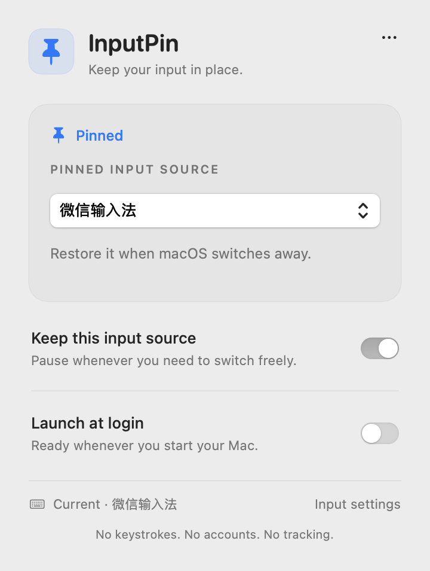
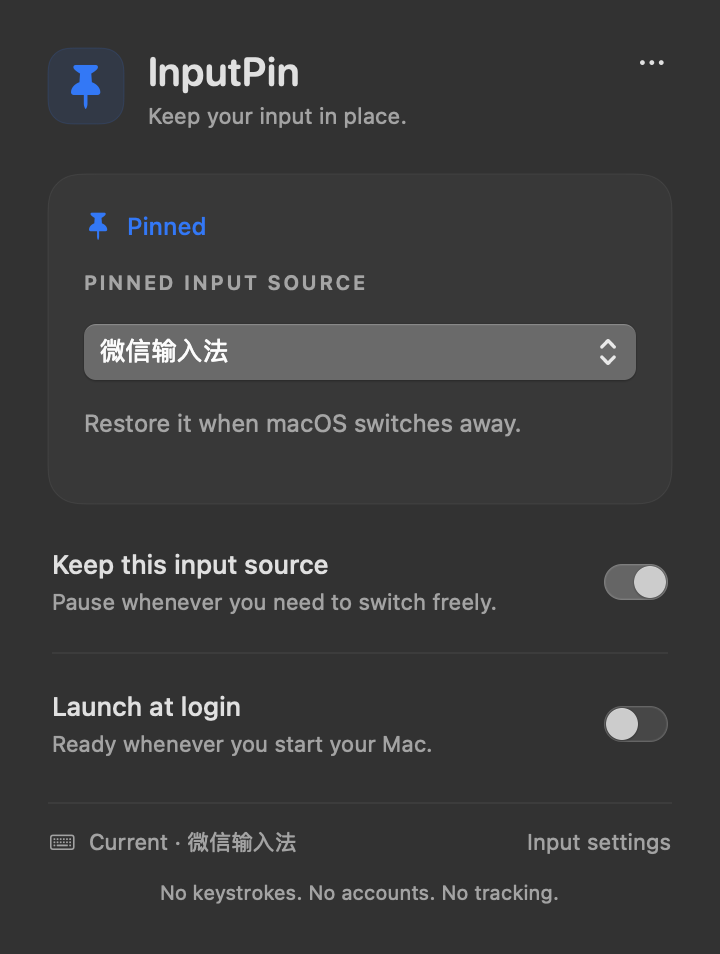

<p align="center">
  
</p>
<h1 align="center">InputPin</h1>
<p align="center"><strong>Keep your input in place.</strong><br>A quiet, native macOS utility for an input source that stays yours.</p>
<p align="center">
  <a href="https://github.com/KaylaONeal/InputPin/actions/workflows/ci.yml"></a>
  <a href="LICENSE"></a>
  
  
</p>
<p align="center">
  <a href="https://github.com/KaylaONeal/InputPin/releases/latest/download/InputPin-1.0.0-universal.dmg"><strong>Binary release (in preparation)</strong></a> ·
  <a href="#homebrew">Homebrew</a> ·
  <a href="docs/README.zh-CN.md">简体中文</a>
</p>

InputPin restores your chosen keyboard input source when macOS switches away. It lives in the menu bar, offers a single pause/resume switch, and leaves your documents and keystrokes alone.

Choose WeType (微信输入法), ABC, or another enabled keyboard input source. A translucent SwiftUI/AppKit panel fits the Mac, with system controls, light/dark appearance and respect for accessibility preferences.

<p align="center"></p>
<p align="center"><sub>Native view renders using example state and an opaque material. Actual translucency follows your desktop.</sub></p>

## Install

**Release status:** the first source and binary distributions are being prepared. Notarized app downloads and the binary cask are being prepared; they are not yet available.

**Binary download (in preparation):** [Download the universal DMG](https://github.com/KaylaONeal/InputPin/releases/latest/download/InputPin-1.0.0-universal.dmg). Open it, drag InputPin into Applications, and launch it. Click the pin in your menu bar to choose an input source. You can also use the [ZIP release](https://github.com/KaylaONeal/InputPin/releases/latest).

Public binary assets will be Developer ID signed, Apple notarized, and stapled before publication. Both Apple Silicon and Intel are included. Requires macOS 13 Ventura or later. See [QA evidence and unverified cases](docs/QA.md).

### Homebrew

```sh
brew install kaylaoneal/tap/inputpin
```

This source formula builds locally and requires Xcode 15+ (Swift 5.9+). Open the installed app with `open "$(brew --prefix inputpin)/InputPin.app"`. It uses the project's [custom Homebrew tap](https://github.com/KaylaONeal/homebrew-tap), with a pinned version and SHA-256 checksum. It is not a claim of inclusion in Homebrew's official catalog.

```sh
brew upgrade kaylaoneal/tap/inputpin
brew uninstall inputpin
```

Turn off launch at login before uninstalling. Source-formula uninstall preserves your settings. Once the binary cask is published, `brew install --cask kaylaoneal/tap/inputpin` will install the notarized DMG directly.

## What it does

- Restores a selected input source after source changes and app activation.
- Suspends restoration during Secure Event Input, sleep or inactive sessions.
- Resumes checking after wake and session activation.
- Offers source selection, one-step pause/resume, and opt-in launch at login.
- Retries rejected switches with bounded exponential backoff, up to 30 seconds.
- Prefers WeType when installed, otherwise uses your current source. It never installs an input method for you.

**Pinning also restores intentional source changes.** Pause before switching to another source. WeType's internal Chinese/English toggle is separate and stays under WeType's control. System login screens are outside the app's scope. Apps that keep secure input enabled continuously will delay restoration; the panel reports that state.

macOS's “Automatically switch to a document's input source” setting can restore a source associated with a document. You may disable it to reduce those switches; this is separate from InputPin's global pinning. See [Apple's input-source settings](https://support.apple.com/guide/mac-help/mchl84525d76/mac).

## Privacy

No keyboard capture. No document inspection. No account, analytics, network requests, Accessibility permission, Input Monitoring permission, or admin access. Source identifiers and two preferences stay on your Mac. [Security policy](SECURITY.md).

## Build from source

Requires macOS and Swift 5.9+ via Xcode Command Line Tools. There are no third-party package dependencies.

```sh
git clone https://github.com/KaylaONeal/InputPin.git
cd InputPin
swift test
bash build.sh
open build/InputPin.app
```

Use `ARCH=universal bash build.sh` for both architectures. Development builds are ad hoc signed and are not the notarized distribution. The CLI supports `inputpin --list`, `--current`, `--version`, and `--select ID`; the brew formula installs the CLI alongside the app.

## Contribute

Read the [contribution guide](CONTRIBUTING.md), [design system](DESIGN.md), and [code of conduct](CODE_OF_CONDUCT.md). Report bugs using the issue form; use [Discussions](https://github.com/KaylaONeal/InputPin/discussions) for questions and workflow ideas. Report vulnerabilities [privately](https://github.com/KaylaONeal/InputPin/security/advisories/new).

[Changelog](CHANGELOG.md) · [Release process](docs/RELEASING.md) · [MIT license](LICENSE)

InputPin is independent and is not affiliated with Apple or Tencent. Third-party input methods remain subject to their own licenses.
